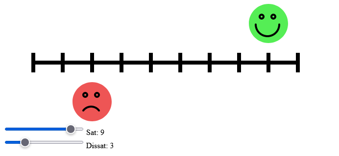

# SatDissatMeter

Tiny web app that visualizes satisfaction/dissatisfaction levels on a scale.

## Requirements

* [dotnet SDK](https://www.microsoft.com/net/download/core) 5.0 or higher
* [node.js](https://nodejs.org)
* An F# editor like Visual Studio, Visual Studio Code with [Ionide](http://ionide.io/) or [JetBrains Rider](https://www.jetbrains.com/rider/)

## Building and running the app

* Install dependencies: `npm install`
* Start the compiler in watch mode and a development server: `npm start`
* After the first compilation is finished, in your browser open: http://localhost:8080/

Any modification you do to the F# code will be reflected in the web page after saving.

> Note: check the "scripts" section in `package.json` to see the commands triggered by the steps above.

## Bundling for release

Run the following command to compile and bundle up all your F# code into one Javascript file: `npm run build`. The compiled output ends up in the `public` folder under the name `bundle.js`.
